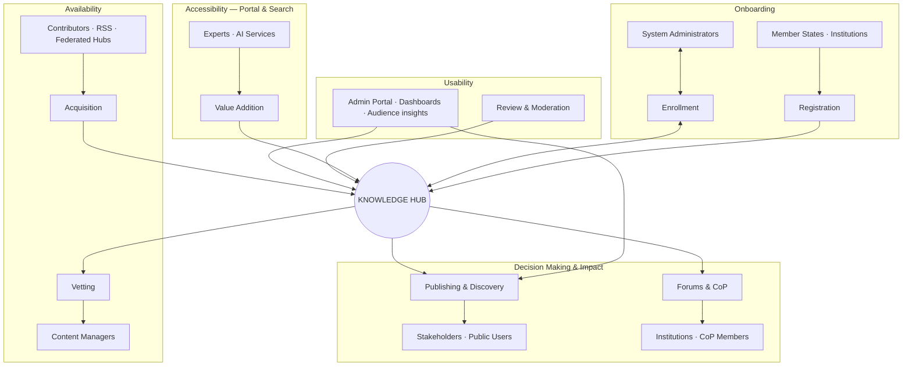

# Knowledge Hub — Knowledge Flow Structure

> How information and users move through the platform · Africa CDC brand colors

---

## Overview

The Knowledge Flow follows five stages intersected by the central **Knowledge Hub** platform layer. Yellow boxes represent **actors/stakeholders**; green rounded boxes represent **processes**; the pink bar is the **platform** where data is stored, indexed, and served.



---

## Brand colors (Africa CDC approved)

| Token | Hex | Diagram use |
|-------|-----|-------------|
| **AU Corporate Green** | `#1A5632` | Process boxes, Knowledge Hub bar, application tier |
| **AU Gold** | `#B4A269` | Stakeholder/actor boxes, presentation tier accents |
| **AU Red** | `#9F2241` | Titles, flow arrows, emphasis |
| **AU Plum** | `#522B39` | Data tier headers, footer text |
| **AU Grey** | `#58595B` | Body text, dividers |
| **AU White** | `#FFFFFF` | Backgrounds |

---

## Stage 1 — Onboarding

| Actor | Process | System implementation |
|-------|---------|----------------------|
| Member states, institutions | **Registration** | Web signup, mobile `/api/register`, OAuth (Microsoft, Google, LinkedIn) |
| System administrators | **Enrollment** | Admin user management, verification, Spatie RBAC roles & permissions |

**Flow:** New users register → profile stored in hub → admins assign roles (`moderate_publication`, `moderate_forum`, `moderate_cop_participants`, etc.).

---

## Stage 2 — Availability

| Actor | Process | System implementation |
|-------|---------|----------------------|
| Contributors, institutions, RSS feeds, peer hubs | **Acquisition** | Publish wizard, API publication upload, RSS scheduled fetch → staging, federation sync → staging, Office→PDF conversion |
| Content managers / moderators | **Vetting** | Pending publications queue, permission-gated approve/reject, metadata validation, approval trail & logs |

**Flow:** Content enters via upload, API, RSS, or federation → staged or pending → moderators vet before release.

---

## Stage 3 — Accessibility (portal & search layer)

| Actor | Process | System implementation |
|-------|---------|----------------------|
| Experts, AI services | **Value Addition** | AI categorization (RSS), tagging, Meilisearch indexing, UI translation, forum/publication summarization, Khub AI (ChatPDF / LLaMA) |

**Flow:** Approved content is enriched, categorized, and indexed so it is discoverable through records search and AI-enhanced search.

---

## Stage 4 — Usability

| Process | System implementation |
|---------|----------------------|
| **Review** | Admin review workflows, bulk approval, CoP participant approval, forum moderation, configurable auto-approve |
| **Admin portal** | Institution dashboards, KPI/performance views, metrics & audience analytics (visits, signups, geography), content publishing tools — helps institutions curate and target knowledge products to the right audience |

**Flow:** Institutions use the admin portal to understand their audience, publish and manage content, and govern quality before full release.

---

## Stage 5 — Decision making & impact

| Process | Outcome | System implementation |
|---------|---------|----------------------|
| **Publishing** | Stakeholders access knowledge | Records search, featured content, web portal, mobile API, federation push to country hubs, email/push notifications |
| **Forums & CoP** | Social engagement & impact | Threaded discussions, community membership, AI forum summaries, likes/comments, RCC dashboards |

**Flow:** Published knowledge reaches decision-makers and practitioners; forums and communities create dialogue and shared learning.

---

## Information flow summary

```
Sources                    Platform                         Outcomes
────────                   ────────                         ────────
User registration    →     User DB + RBAC              →    Role-based access
Upload / API / RSS   →     Staging / Pending           →    Moderation queue
Federation sync      →     Federated staging           →    Admin approval
Approved content     →     DB + Meilisearch + Storage  →    Search & discovery
Enriched metadata    →     AI + tags + translations    →    Accessibility
Published resources  →     Web + Mobile API            →    Decision support
Forum / CoP activity →     Notifications + analytics   →    Social impact
```

---

## Related documentation

| Document | Path |
|----------|------|
| System architecture | `docs/architecture/KH_Portal_Architecture.md` |
| Federation | `docs/features/FEDERATION.md` |

---

*Knowledge Hub Platform*
