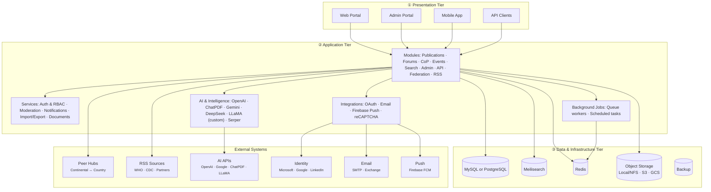
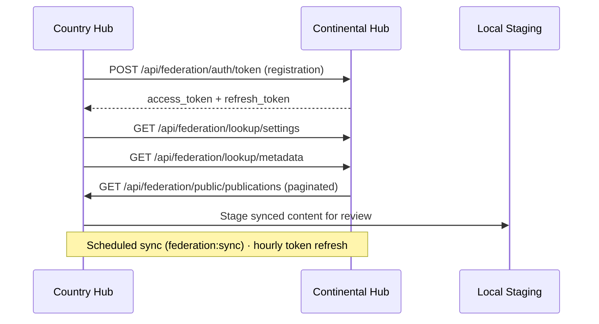
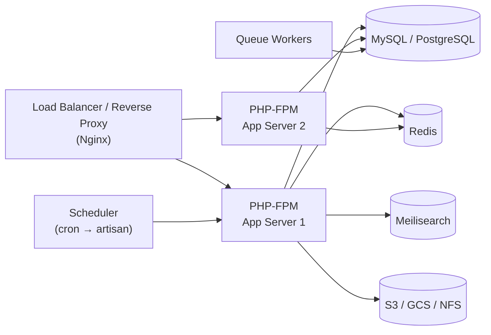

# Knowledge Hub Platform — System Architecture

> **v2.7** · Africa CDC brand colors · Three-tier layered design

---

## 1. Architecture overview

The Knowledge Hub is a **monolithic web application** that serves a public knowledge portal, an **administration console**, a **REST API** for mobile clients, and a **federation API** for continental ↔ country hub interoperability.



### Interaction flows (diagram arrows)

| From | To | Protocol / pattern |
|------|-----|-------------------|
| Web Portal | Application tier | HTTPS sessions, server-rendered requests |
| Admin Portal | Application tier | HTTPS sessions, RBAC-gated admin routes |
| Mobile App | Application tier | REST API, OAuth2 bearer tokens |
| API Clients | Application tier | REST / Federation API, OAuth2 |
| Application tier | MySQL / PostgreSQL | SQL read/write via ORM |
| Application tier | Meilisearch | Scout index sync & search queries |
| Application tier | Redis | Cache, sessions, queue backend |
| Application tier | Object storage | File upload/download (local, S3, GCS) |
| Background jobs | Redis / DB | Async queue processing |
| Application tier | External systems | HTTPS outbound (AI, OAuth, email, push, federation) |

---

## Brand colors (Africa CDC approved)

| Token | Hex | Diagram use |
|-------|-----|-------------|
| **AU Corporate Green** | `#1A5632` | Application tier, footer, primary accents |
| **AU Gold** | `#B4A269` | Presentation tier, external systems |
| **AU Red** | `#9F2241` | Security accents, emphasis |
| **AU Plum** | `#522B39` | Data & infrastructure tier |
| **AU Grey** | `#58595B` | Body text |
| **AU White** | `#FFFFFF` | Backgrounds |

---

## 2. Presentation tier

| Channel | Technology | Users |
|---------|------------|-------|
| **Web portal** | Server-rendered Blade templates, Bootstrap, jQuery | Public, contributors, reviewers |
| **Admin portal** | `/admin/*` — dashboards, KPIs, metrics, audience analytics, content publishing & moderation | Institutions, RCCs, administrators, content managers |
| **Mobile application** | Native/hybrid iOS & Android consuming `/api/*` | Field users, CoP members |
| **External API clients** | REST + OAuth2 (Passport); OpenAPI | RCC tools, integrations, federation peers |

**Primary user roles:** Admin · Reviewer/Moderator · Contributor · CoP Member · RCC · MEL · Public (anonymous/guest)

---

## 3. Application / business tier

### 3.1 Core platform

| Component | Purpose |
|-----------|---------|
| **Application framework** | HTTP routing, MVC, ORM, middleware, service container |
| **Spatie Permission** | RBAC — granular permissions (e.g. `moderate_publication`, `moderate_forum`, `moderate_cop_participants`) |
| **Passport** | OAuth2 access/refresh tokens for API and mobile |
| **Socialite** | Microsoft, Google, LinkedIn social login |

### 3.2 Functional modules

| Module | Capabilities |
|--------|--------------|
| **Publications** | Publish wizard, attachments, Office→PDF conversion, versioning, favourites, comments, Khub AI PDF chat |
| **Forums** | Threaded discussions, moderation, AI summarization |
| **Communities of Practice (CoP)** | Membership approval, invitations, community content |
| **Events & Courses** | Calendar events, e-learning course listings (API) |
| **Quiz & FAQ** | Interactive quiz, knowledge FAQs |
| **Records search** | Faceted search, publication cards, optional AI-enhanced search |
| **My Space** | User library, favourites, profile, publish history |
| **Content requests** | User-submitted content needs workflow |
| **RSS ingestion** | Scheduled fetch → staging → admin approval → publication |
| **KPIs & dashboards** | RCC dashboard, performance indicators, hub analytics |
| **Federation** | Continental ↔ country hub sync, branding/metadata import |

### 3.3 Admin panel (`/admin`)

| Area | Functions |
|------|-----------|
| **Configure** | Branding, colors, typography, social login, AI settings, search options, auto-approve toggles |
| **Dashboards & insights** | Hub dashboard stats, RCC/KPI dashboards, metrics (visits, signups, country maps), AI insights, target-audience analytics |
| **Moderation** | Approve/reject publications, forums, CoP participants (permission-gated) |
| **Users & roles** | User management, Spatie role/permission assignment |
| **Federation** | Register remote hubs, connect, sync public content |
| **System** | Hub deployment type (continental/country), installation wizard |

### 3.4 API surface

| API group | Base path | Auth |
|-----------|-----------|------|
| **Mobile / REST** | `/api/*` | Passport `auth:api` |
| **Federation** | `/api/federation/*` | Bearer token / OAuth registration |
| **Lookup** | `/api/lookup/*` | Public (settings, metadata for mobile) |
| **AI** | `/api/ai/*` | Authenticated |

Key mobile endpoints: publications, forums, communities, events, courses, push notifications, home feed, profile.

### 3.5 AI & intelligence

Single configurable routing layer (`config/ai.php`) — no separate orchestration tier:

| Provider | Use cases |
|----------|-----------|
| **OpenAI** | Forum summaries, insights, translation, AI search chat, title formatting |
| **ChatPDF** | Document Q&A on publication PDFs (Khub AI) |
| **Google Gemini** | Alternative chat completions |
| **DeepSeek** | OpenAI-compatible alternative |
| **Custom / LLaMA** | On-prem deployment — **LLaMA is currently deployed** for selected features via OpenAI-compatible endpoint |
| **Serper** | Web search augmentation for AI search |

Admin configures providers per feature; credentials from environment or database.

### 3.6 Integration adapters

| Integration | Protocol | Purpose |
|-------------|----------|---------|
| **Microsoft / Google / LinkedIn** | OAuth 2.0 | Social login |
| **SMTP / Exchange** | SMTP, EWS | Transactional email (PHPMailer, Exchange service) |
| **Firebase FCM** | HTTP | Mobile push notifications |
| **reCAPTCHA** | HTTP | Bot protection on forms |
| **Excel import/export** | File | Bulk publication import (Maatwebsite Excel) |

### 3.7 Async processing

| Worker | Jobs |
|--------|------|
| **Queue** (Redis or database driver) | Email dispatch, RSS fetch, federation sync, approval notifications, AI chat prune |
| **Scheduler** (`artisan schedule`) | `federation:sync`, `federation:refresh-central-token`, RSS feeds, daily approval summaries |

---

## 4. Data & infrastructure tier

### 4.1 Relational database (MySQL or PostgreSQL)

Configured via `DB_CONNECTION` in environment:

```
DB_CONNECTION=mysql    # MySQL
DB_CONNECTION=pgsql    # PostgreSQL
```

Laravel Eloquent abstracts dialect differences; Doctrine DBAL supports schema operations on both engines.

**Primary data domains:** users, roles/permissions, publications, forums, communities, events, settings, federation registry, RSS staging, approval logs, AI chat sessions.

### 4.2 Search engine

| Engine | Integration |
|--------|-------------|
| **Meilisearch** | Laravel Scout driver — full-text index on publications (title, description, tags, authors, countries) |
| **Collection driver** | Fallback for development (in-memory) |

### 4.3 Cache & sessions

| Store | Driver | Use |
|-------|--------|-----|
| **Redis** (recommended prod) | Predis | Application cache, sessions, queue backend |
| **File** | Default dev | Cache fallback |

Federation manifest and lookup payloads are cached to reduce cross-hub latency.

### 4.4 Object storage

Configurable via `FILESYSTEM_DRIVER` and disk settings:

| Option | Driver | Typical use |
|--------|--------|-------------|
| **Local / NFS (`hub-media`)** | Filesystem | On-prem or shared NFS — publication attachments, covers, documents |
| **Public disk** | Local + symlink | Web-accessible assets via `/storage` |
| **AWS S3** | S3-compatible | Cloud object storage (scalable deployments) |
| **Google Cloud Storage** | GCS Flysystem | Cloud object storage (GCP environments) |

Office documents may be converted to PDF on upload before storage.

### 4.5 Backup & replication

- Database backups (operator-managed mysqldump / pg_dump)
- Optional read replicas at infrastructure level
- Federated hub cached public data stored in `federated_knowledge_hubs.cached_public_data`

---

## 5. Federation & external interoperability



| Pattern | Description |
|---------|-------------|
| **Hub types** | Continental (`admin_units_enabled=false`) ↔ Country/regional (`admin_units_enabled=true`) |
| **Auth** | OAuth registration token exchange; automatic refresh |
| **Sync** | Public publications & forums pulled into staging; admin approves before publish |
| **Metadata** | Themes, tags, licenses, branding imported from central hub |

### External system examples

| Category | Systems / providers |
|----------|---------------------|
| **Peer hubs** | Continental hub ↔ country/regional hubs (OAuth federation sync) |
| **RSS sources** | WHO, CDC, partner publisher feeds |
| **AI APIs** | OpenAI, Google (Gemini), ChatPDF, Serper, on-prem LLaMA |
| **Identity** | Microsoft Entra, Google, LinkedIn (OAuth 2.0) |
| **Email** | SMTP, Microsoft Exchange |
| **Push** | Firebase Cloud Messaging (FCM) |

---

## 6. Languages & runtime stack

| Layer | Languages / frameworks |
|-------|------------------------|
| **Backend** | PHP, Laravel |
| **Frontend (web)** | HTML, Blade, CSS, Bootstrap, JavaScript, jQuery |
| **Mobile** | Consumes JSON API (client stack independent of server) |
| **Database** | SQL (MySQL or PostgreSQL dialect) |
| **Search** | Meilisearch |
| **Build / ops** | Composer, npm, Artisan CLI |

---

## 7. Performance & scalability

| Technique | Implementation |
|-----------|----------------|
| **PHP OPcache** | Bytecode cache in production PHP-FPM |
| **Redis caching** | Settings, federation manifests, expensive lookups |
| **Meilisearch** | Offloads full-text search from RDBMS |
| **Queue workers** | Async email, RSS, federation — keeps HTTP requests fast |
| **Eager loading** | Eloquent `with()` on list/datatable queries |
| **API pagination** | Cursor/page limits on federation and list endpoints |
| **DB indexing** | Indexes on approval status, foreign keys, search facets |
| **CDN** | Static assets (CSS, JS, images) via reverse proxy/CDN |
| **Scout chunked indexing** | Batch reindex (500 records/chunk) |
| **HTTP caching headers** | Public lookup/settings endpoints |

**Horizontal scaling:** Stateless PHP-FPM behind load balancer; shared Redis, DB, Meilisearch, and object storage.

---

## 8. Security

| Area | Controls |
|------|----------|
| **Authentication** | Session-based web login; OAuth2 bearer tokens (Passport) for API/mobile; social login via trusted IdPs |
| **Authorization** | Role-based access control (Spatie); permission-gated admin routes; moderation permissions per content type |
| **Transport** | HTTPS/TLS in production; encrypted token exchange for federation |
| **Federation** | Registration tokens, OAuth access/refresh, optional static bearer; automatic token refresh |
| **Input & data** | Form validation, parameterized queries, HTML sanitization on rich text, SQL injection-safe search |
| **File handling** | Upload type checks, Office→PDF conversion pipeline, storage outside web root where applicable |
| **Content workflow** | Approval gates for publications, forums, and CoP participants; audit trails on approval actions |
| **Bot protection** | reCAPTCHA on public forms |
| **Secrets** | API keys in environment or encrypted settings; federation tokens stored server-side only |

---

## 9. Deployment topology (reference)



---

## 10. Related documentation

| Document | Path |
|----------|------|
| Federation | `docs/features/FEDERATION.md` |
| AI configuration | `config/ai.php` |
| Database config | `config/database.php` |
| API routes | `routes/api.php` |

---

*Knowledge Hub Platform Architecture*
